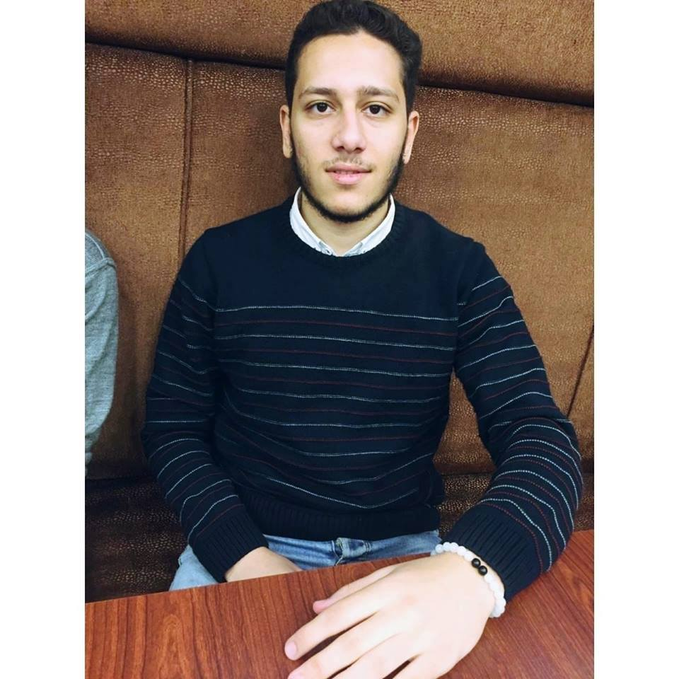

## Welcome To My Website

## Bio

**Name** : Galal Hosam Eldien

**Age** : 21

**University** : Cairo University

**Faculty** : Engineering

**Department** : Systems and Biomedical Engineering

**Academic year** : 3rd year

**E-mail** : galalhossam555@gmail.com

## About :
I am studying systems and biomedical engineering at the faculty of engineering, Cairo University. I had been volunteering in student activities like BEAT for two years.

## Skills :
- Technical Skills:

	- HTML
	- CSS
	- Git
	- C
	- C++
	- R 
	- Latex
	- Arduino    

- Soft Skills:

    - Communication Skills
    - Presentation Skills
    - Research Skills
    - Time Management
    - Problem Solving

# To get in touch:

         
